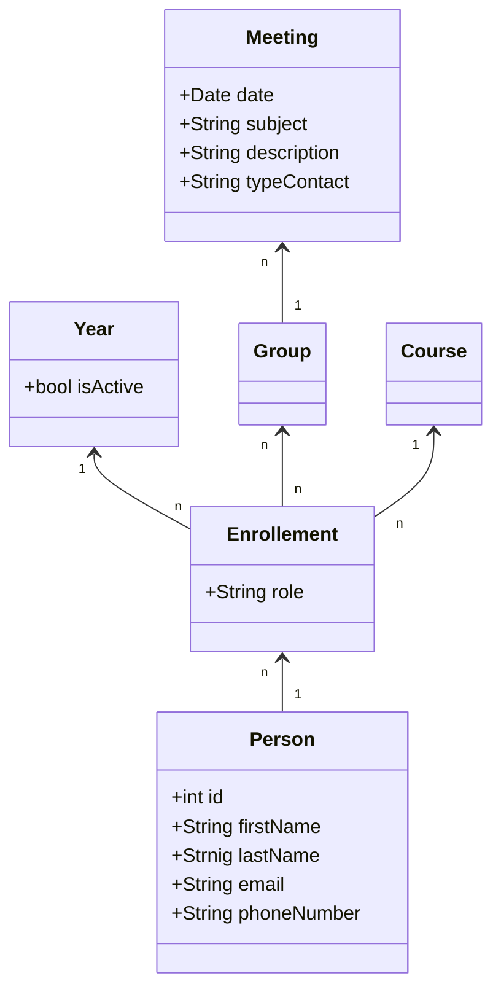

# TutoringPlatform
Esta plataforma foi desenvolvida para dar facilitar o todo o processo de gestão por parte dos serviços de tutoria da Universidade de Trás-os-Montes e Alto Douro.
### Requisitos
...

### Diagrama de classes

