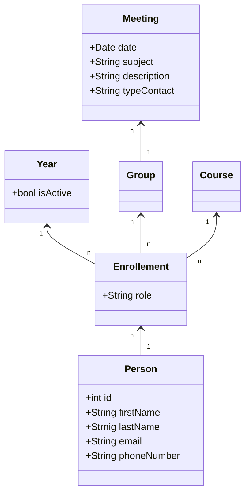

# TutoringPlatform
Esta plataforma foi desenvolvida para facilitar o processo de gestão por parte dos serviços de tutoria da Universidade de Trás-os-Montes e Alto Douro.

## Mock Services e Ambiente de Teste
Para facilitar o desenvolvimento e testes sem dependências externas (ex: serviços da UTAD), foi criado um projeto `MockServices` que simula as respostas das APIs reais.

### Funcionalidades Simuladas (Mock)
O serviço Mock (`http://localhost:5000`) substitui os seguintes endpoints:
- **Autenticação**: `POST /MS/IUTADAuth` - Simula login na UTAD.
- **Dados de Docente**: `GET /MS/RCU/v1/Utilizadores/Get` - Retorna dados simulados de docentes.
- **IUPI de Estudante**: `GET /MS/Estudante_IUPI_RCU_S/{username}` - Gera um IUPI fictício.
- **Perfil de Estudante**: `GET /MS/Estudante_Perfis_RCU_S/{iupi}` - Retorna dados simulados de alunos.
- **Lista de Cursos**: `GET /MS/SIGAcad/v1/Cursos/List` - Retorna uma lista fixa de cursos para teste.

## Credenciais para Teste
A base de dados é inicializada automaticamente com os seguintes utilizadores para permitir testar todos os perfis da aplicação.

### 1. Gestor (Manager)
Permite gerir anos letivos, cursos e criar grupos de tutoria.
- **Username**: `manager`
- **Password**: `Manager123!`

### 2. Tutor
Permite visualizar a lista de tutorandos atribuídos e agendar reuniões.
- **Username**: `tutor`
- **Password**: `Tutor123!`
- *(Tutor adicional para testes manuais)*: `tutor2` / `Tutor123!`

### 3. Mentor
Aluno mais velho que apoia os novos alunos.
- **Username**: `mentor`
- **Password**: `Mentor123!`
- *(Mentor adicional para testes manuais)*: `mentor2` / `Mentor123!`

### 4. Tutorando (Student)
Aluno do 1º ano que recebe apoio.
- **Username**: `tutee`
- **Password**: `Tutee123!`
- *(Alunos extra para volume)*: `aluno1` a `aluno5` / `Dummy123!`

### 5. Administrador e Outros
- **Admin**: `admin` / `Admin123!`
- **User Legado**: `al55555` / `Dummy123!` (Role: Tutor/Mentor)

---

### Diagrama de classes

